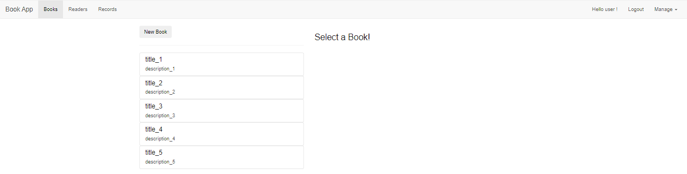

# BookLibraryApp

```bash
This project was generated with [Angular CLI](https://github.com/angular/angular-cli) version 16.1.4.
Using nodeJS v16.16.0, VS code
```

## Development server

Run `ng serve` for a dev server. Navigate to `http://localhost:4200/`.

## Basic functionalities of this app:

```bash
Upon accessing page, user will be prompted to login / sign up:
```


```bash
After logging in, user will be able to view books, readers and records
```



```bash
Upon clicking New Book, can create a new book
```


```bash
Upon clicking on an existing book, can view the book details
```


```bash
Upon clicking on the drop down, can edit the book / delete the book
```


```bash
Upon chossing edit the book
```


```bash
Upon chossing readers tab.
Has similar functionalties to books.
```


```bash
Upon chossing records tab.
Has similar functionalties to books.
```


```bash
If login with admin role, has extra users tab
Able to see all users, update a user role, delete a user
```


## Build

Run `ng build` to build the project. The build artifacts will be stored in the `dist/` directory.

```

```
